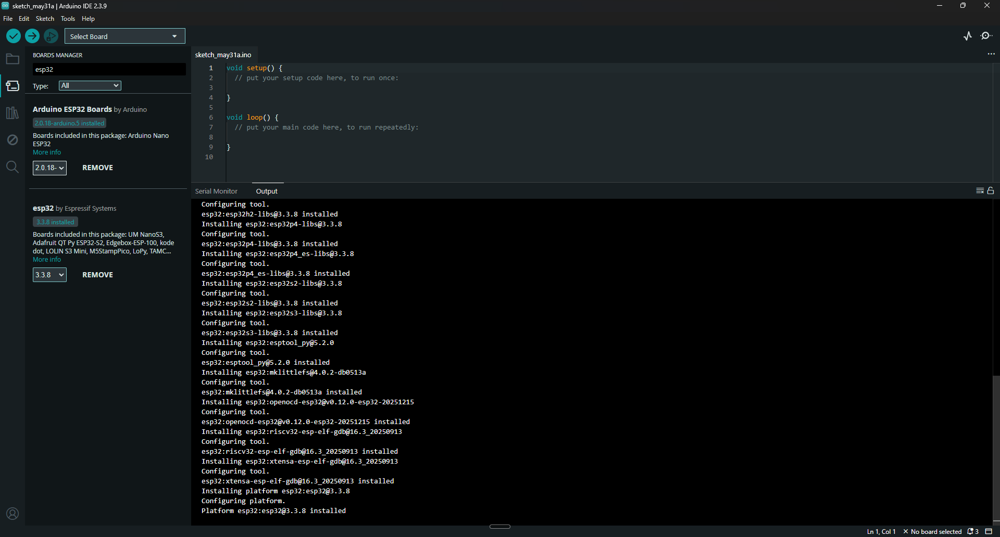
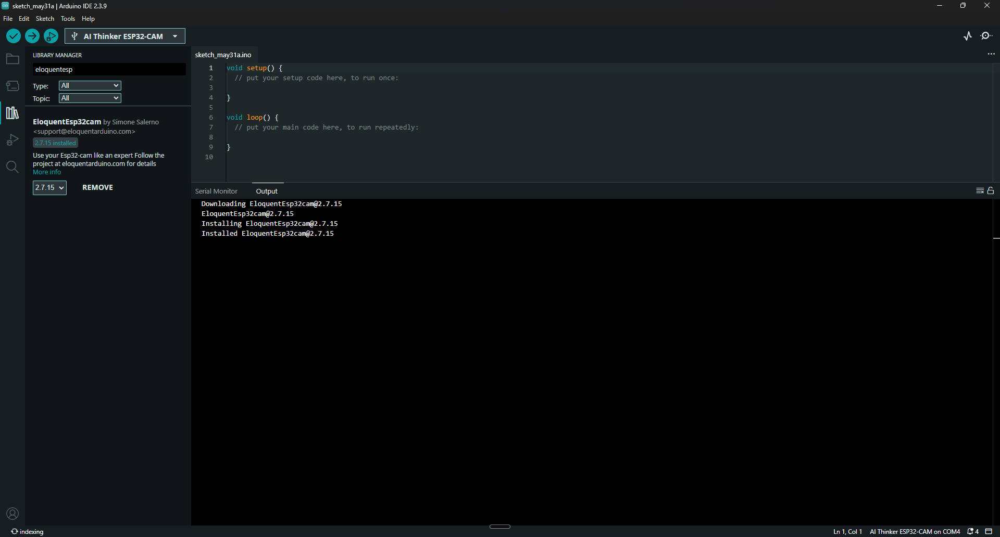
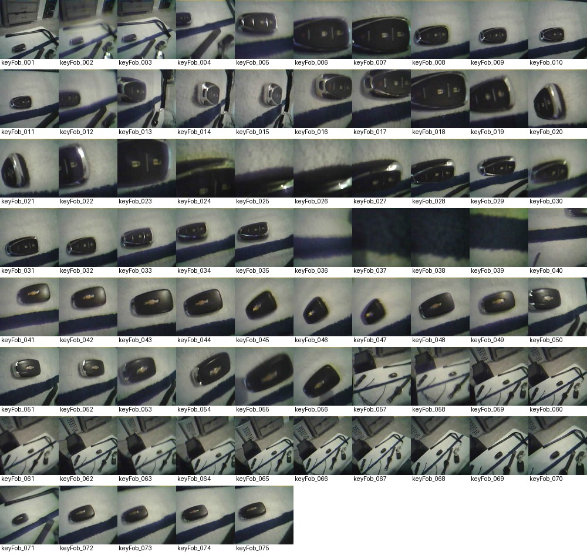
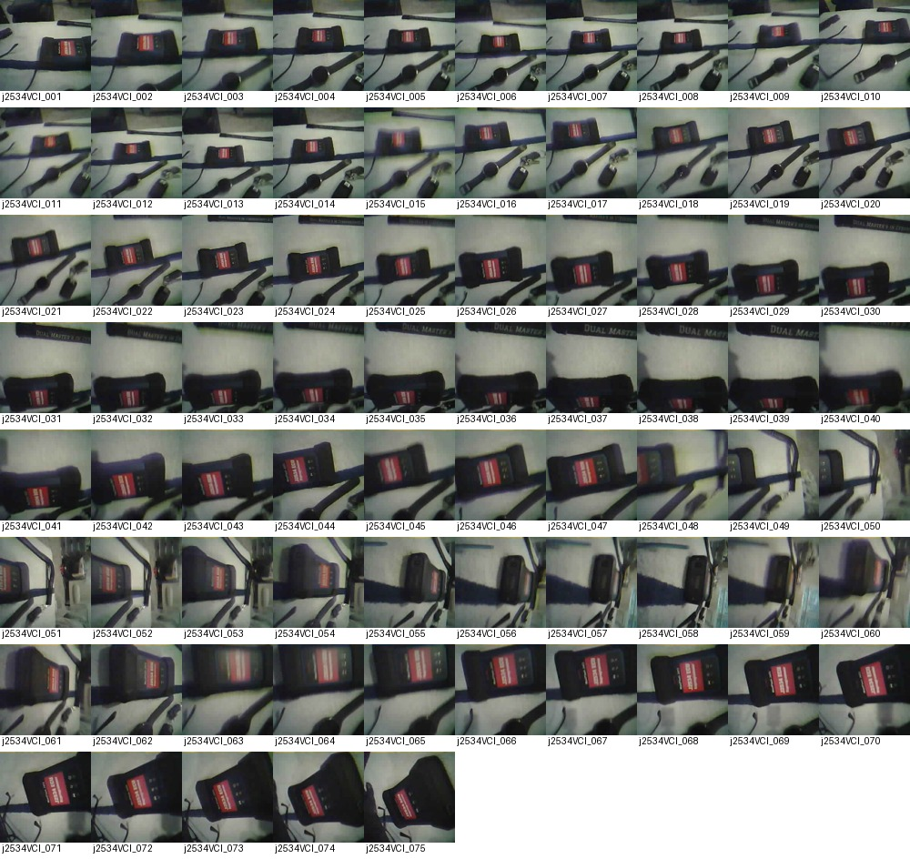
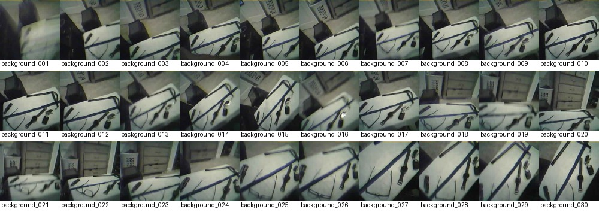
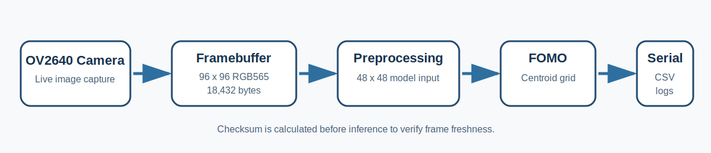
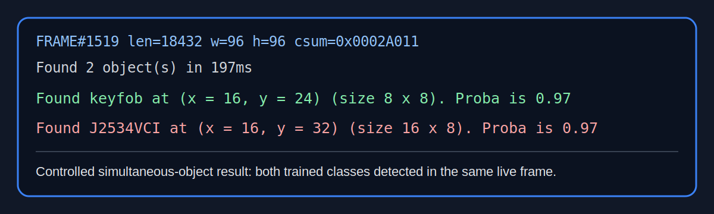
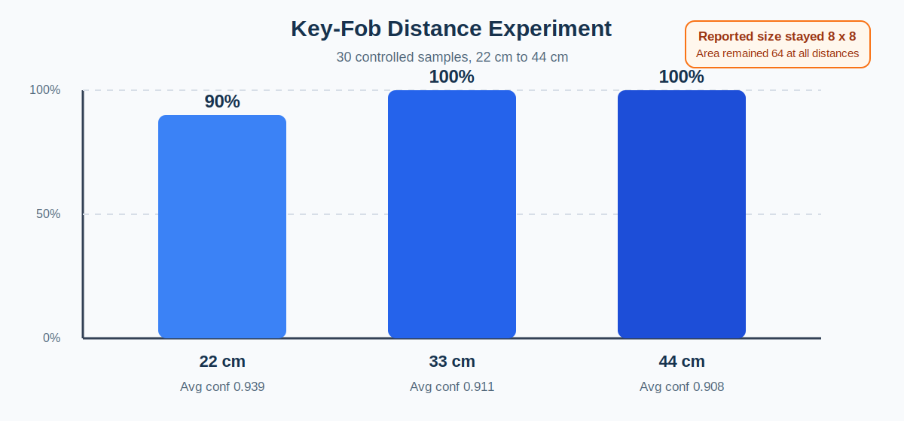

# Evidence Index

## Existing setup screenshots

### ESP32 board package installed

### AI Thinker ESP32-CAM selected with EloquentEsp32cam

## Dataset contact sheets

### Key-fob samples

### J2534VCI samples

### Negative/background samples

## Technical figures

### Embedded inference pipeline

### Simultaneous-detection evidence

### Distance-experiment result

## Raw evidence files

- [Controlled J2534VCI detections](../evidence/controlled_j2534vci_detection.txt)
- [Controlled key-fob detections](../evidence/controlled_keyfob_detection.txt)
- [Controlled simultaneous two-class detections](../evidence/controlled_two_class_detection.txt)
- [Key-fob distance serial log](../evidence/keyfob_distance_serial_log.txt)
- [Key-fob distance CSV dataset](../data/keyfob_distance_results.csv)

## Interpretation notes

- [Technical discoveries](technical-discoveries.md)
- [Experiment notebook](experiment-notebook.md)
- [Results](results.md)
- [Troubleshooting](troubleshooting.md)
- [Model limitations](model-limitations.md)
